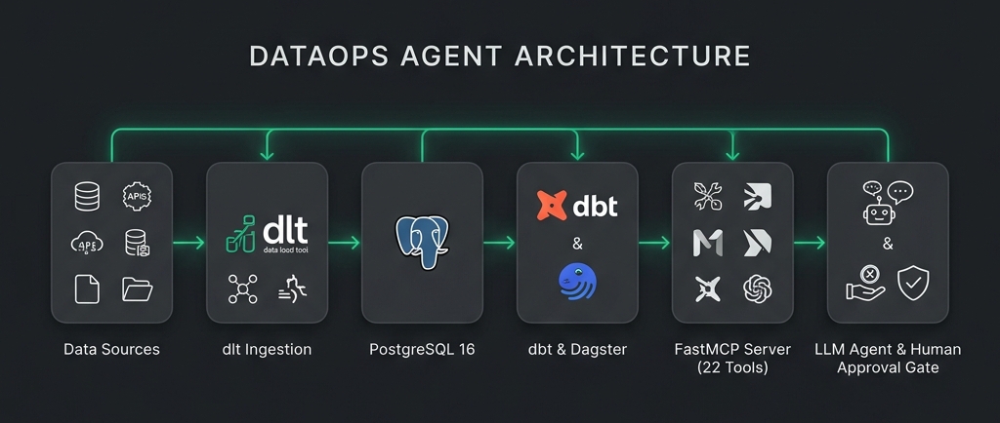

# DataOps Agent

An agentic DataOps platform that monitors batch data pipelines, diagnoses data-quality failures via Model Context Protocol (MCP) tools, and executes human-approved recovery workflows.

[Live Interactive Demo](https://anwarmousa.me/demo/dataops)

---

## 1. What It Does

DataOps Agent closes the operational loop for data engineering pipelines:

```text
Observe → Investigate → Diagnose → Approve → Remediate → Verify → Resolve
```

1. **Detects**: Catches data quality violations using `dbt` test assertions and Dagster asset checks.
2. **Investigates**: Traces upstream lineage and column metrics via 22 standardized read-only **Model Context Protocol (MCP)** tools.
3. **Diagnoses**: Produces evidence-grounded root cause reports with confidence scores.
4. **Proposes**: Formulates allowlisted remediation plans with risk assessments.
5. **Requires Approval**: Enforces a strict **Human Approval Gate** (the AI Agent is forbidden from approving its own actions).
6. **Remediates**: Executes idempotent allowlisted actions (`quarantine_invalid_records`, `refresh_dbt_model`, `rerun_dagster_asset`).
7. **Verifies**: Audits post-remediation data assertions and asset health before marking incidents **RESOLVED**.

---

## 2. End-to-End System Architecture



```text
                               Local / Docker Compose
                                           │
                     ┌─────────────────────┴─────────────────────┐
                     │                                           │
               Next.js Web UI                              FastAPI Backend
             (web/ : Port 3000)                           (api/ : Port 8000)
                     │                                           │
                     │          ┌────────────────────────────────┼────────────────────────────────┐
                     │          │                                │                                │
                     │   PostgreSQL (5433)                Dagster (3000)                     MCP Server
                     │          │                                │                                │
                     │          └────────────────────────────────┼────────────────────────────────┘
                     │                                           │
                     │                                     DataOps Agent
                     │                                           │
                     │                                    Remediation Engine
                     │                                           │
                     └───────────────────── REST API ────────────┘
```

---

## 3. Technology Stack

- **Ingestion**: Python 3.11+, `dlt` (data load tool)
- **Database**: PostgreSQL 16
- **Transformation & Data Quality**: `dbt` (dbt-core, dbt-postgres) with 27 data quality assertions
- **Orchestration & Lineage**: `Dagster` (dagster-webserver, dagster-dbt)
- **Observability & Diagnosis**: Pydantic health signal layer, deterministic diagnosis engine
- **Tool Protocol**: Model Context Protocol (FastMCP SDK, stdio transport, 22 tools)
- **Agentic Engine**: Python, Configurable `LLMProvider` (`OpenRouterLLMProvider` for live OpenRouter API reasoning, `OpenAILLMProvider`, and `FakeLLMProvider` for deterministic testing)
- **Remediation Engine**: Allowlisted execution, `ApprovalService` (30m TTL & self-approval block), `RemediationExecutor`, and `RecoveryVerifier`
- **Backend Adapter**: FastAPI (`api/main.py`), Uvicorn
- **Web Control Plane**: Next.js 16, TypeScript, Tailwind CSS, Lucide icons, Dark/Light mode theme engine (`web/`)
- **Testing**: `pytest` (69 unit, integration, API, and safety tests)

---

## 4. Web Control Plane & Live Interactive Demo

The platform features an operational web control plane:

- **Live Interactive Demo**: Available at [https://anwarmousa.me/demo/dataops](https://anwarmousa.me/demo/dataops).
- **Live Mode**: Connects directly to the FastAPI backend adapter (`http://localhost:8000/api`) to display live pipeline nodes, incident logs, MCP investigation steps, and execution status.
- **Demo / Sandbox Mode**: Provides a deterministic sandbox simulation for public portfolio deployments where backend credentials are isolated.
- **Design Philosophy**: Built using the rounded design system and dark-first visual language of the **Ayn platform** (`https://aynplatform.app/`).

---

## 5. Portfolio Demo & Multi-Service Deployment

The project can be presented in two useful ways:

1. **Portfolio Demo Page**: Access the live interactive demo at [https://anwarmousa.me/demo/dataops](https://anwarmousa.me/demo/dataops).
2. **Full Local Stack**: Run the full Docker Compose environment when you want the backend, Postgres, Dagster, MCP tools, and remediation flow working together.

| Service | Technology | Port | Description |
|---|---|---|---|
| `postgres` | PostgreSQL 16 | 5433:5432 | Primary relational store (`raw_data`, `staging`, `intermediate`, `marts`) |
| `dagster` | Dagster 1.6+ | 3000:3000 | Software-defined asset orchestrator & lineage UI |
| `api` | FastAPI / Uvicorn | 8000:8000 | REST API adapter exposing system state & remediation endpoints |
| `web` | Next.js 16 | 3001:3000 | Portfolio-ready operational control center |

Build the public portfolio demo:
```bash
cd web
npm run build
```

Start the full stack with Docker Compose:
```bash
make docker-up
```

Stop the full stack:
```bash
make docker-down
```

---

## 6. How to Run Locally

### Option A: Local Development Mode
```bash
# 1. Start Postgres database container
make up

# 2. Ingest raw data & run dbt transformations
python -m ingestion.pipeline
make dbt-run
make dbt-test

# 3. Start FastAPI backend adapter (Terminal 1)
make api-dev

# 4. Start Next.js web control plane (Terminal 2)
make web-dev
```

### Option B: Pytest Test Suite
```bash
make test
# Or: .venv/bin/pytest tests/ -v
```

---

## 7. Safety Statement

> **AI proposes. Humans approve. The system executes.**

1. **Zero Direct Write Access**: The AI Agent interacts exclusively through read-only and proposal MCP tools. Raw SQL (`execute_sql`) and shell commands are forbidden.
2. **Mandatory Human Approval**: The AI Agent cannot approve its own plan. Approvals require human operator interaction and expire after 30 minutes.
3. **Allowlisted Execution**: Remediation is strictly restricted to explicit allowlisted actions (`quarantine_invalid_records`, `refresh_dbt_model`, `rerun_dagster_asset`).
